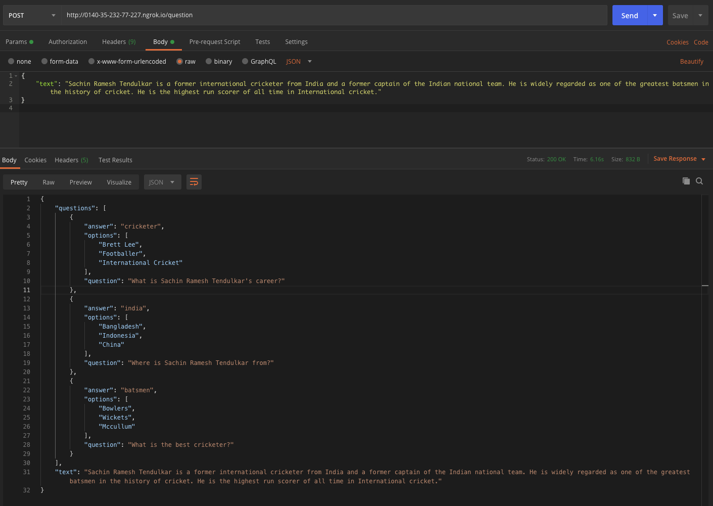

# Guide to use API

1. Import the project in Google Colab, or use the one in this link:
https://colab.research.google.com/drive/1L9GaM83mZsIvwUGtDiRR-piu0e2pGCbD?usp=sharing

2. Run the entire code base

3. When running the "Endpoint" section, you will see something like this:
```sh
 * Serving Flask app "__main__" (lazy loading)
 * Environment: production
   WARNING: This is a development server. Do not use it in a production deployment.
   Use a production WSGI server instead.
 * Debug mode: off
 * Running on http://127.0.0.1:5000/ (Press CTRL+C to quit)
 * Running on http://0140-35-232-77-227.ngrok.io
 * Traffic stats available on http://127.0.0.1:4040
 ```

For every time you run this service, **copy the link ending with ngrok.io**

```sh
Running on http://0140-35-232-77-227.ngrok.io
```

The link is generated everytime it runs, so don't forget to update it on your development environment.

This can be performed in Postman, for development purpose;



### Endpoint Guides

You cann read the guidelines on the .ipynb file, or go to the Google Colab link:
https://colab.research.google.com/drive/1L9GaM83mZsIvwUGtDiRR-piu0e2pGCbD?usp=sharing
